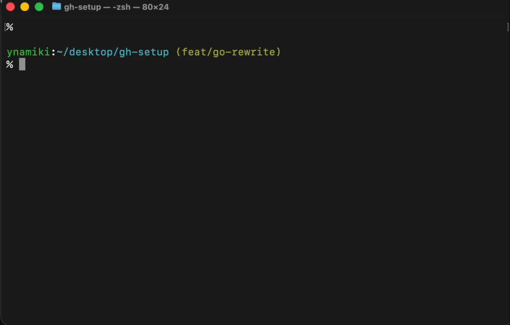

# gh-setup

Interactive CLI for GitHub repository setup — branch protection, milestones, labels & more.



## How to use

```bash
npx gh-setup
```

## Prerequisites

- [GitHub CLI (`gh`)](https://cli.github.com) installed and authenticated
- Node.js 18+

## Commands

```
gh-setup <command>

Commands:
  init          Repository setup (branch protection, settings, security)
  milestones    Create/update weekly milestones
  labels        Sync labels from .gh-setup.yml
```

Running `gh-setup` without a command shows the help message.

### `init`

Walks you through configuring a GitHub repository interactively:

1. **Branch protection** — block direct pushes, require PR reviews, status checks, etc.
2. **Repository settings** — auto-delete branches, merge strategies
3. **Security** — Dependabot alerts, secret scanning, push protection

```bash
npx gh-setup init
```

### `milestones`

Creates or updates weekly milestones. Reads configuration from `.gh-setup.yml` or prompts interactively.

```bash
npx gh-setup milestones
```

- Detects existing milestones by due date to avoid duplicates
- Updates title/description if a milestone with the same due date exists
- Title format: `Week {n}: {end_date}` (Saturday)
- Due date: Saturday 23:59:59 in configured timezone (auto-converted to UTC)

### `labels`

Syncs labels from `.gh-setup.yml` to the repository.

```bash
npx gh-setup labels
```

- Creates missing labels
- Updates labels with changed color/description
- Does **not** delete labels missing from config (safe by default)
- Shows a diff summary before applying changes

## Configuration (`.gh-setup.yml`)

Place a `.gh-setup.yml` in your repository root for declarative configuration:

```yaml
milestones:
  startDate: "2026-01-04"   # First Sunday (YYYY-MM-DD)
  weeks: 52                  # Number of weekly milestones
  timezone: "Asia/Tokyo"     # IANA timezone (due = Saturday 23:59:59 in this TZ)

labels:
  - name: "bug"
    color: "d73a4a"
    description: "Something isn't working"
  - name: "feature"
    color: "0075ca"
    description: "New feature or request"
  - name: "documentation"
    color: "0075ca"
    description: "Improvements or additions to documentation"
```

The config file is optional — `milestones` falls back to interactive prompts, and `labels` requires the config.

## Development

```bash
npm install
npm run build
node dist/index.js
```

## License

MIT
